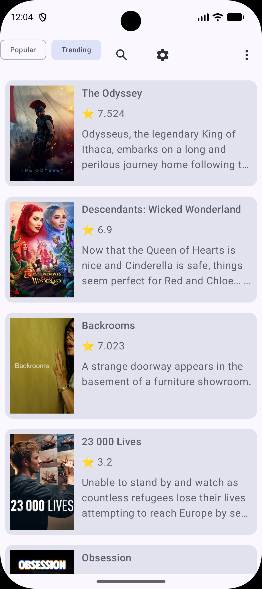
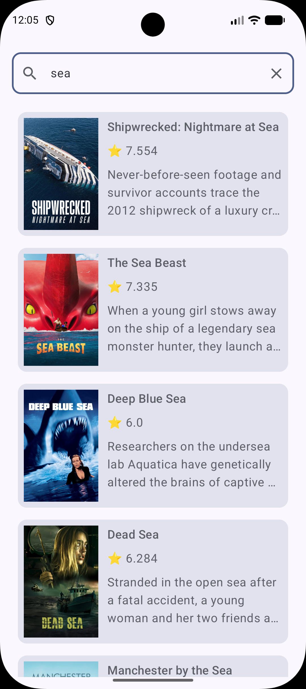
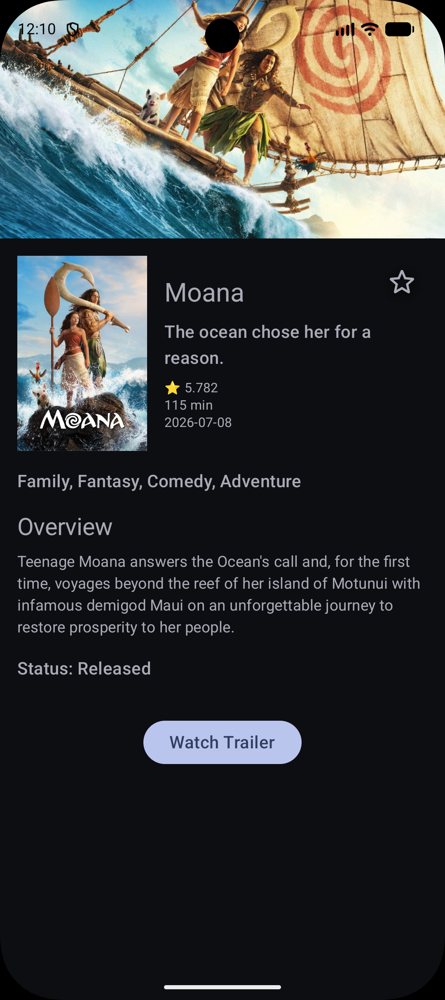
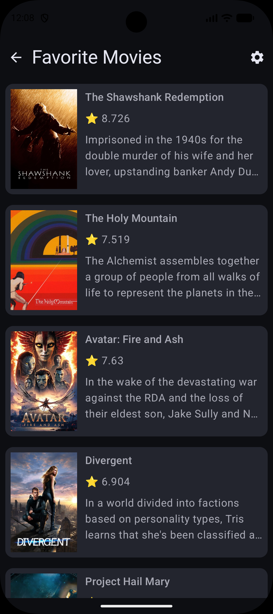
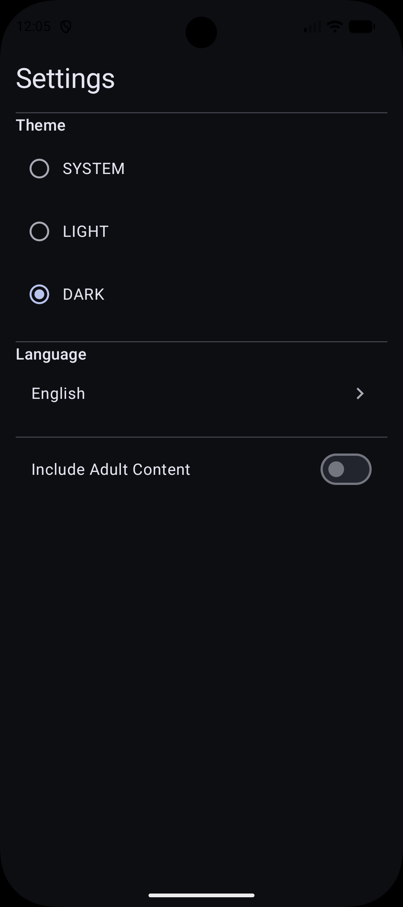

# MoviesCatalog

MoviesCatalog is a modern Android application built with Jetpack Compose and Clean Architecture that allows users to discover popular and trending movies, search for titles, watch trailers, and manage favorites.

## Features

* Browse Popular Movies
* Browse Trending Movies
* Search Movies
* Search History
* Movie Details
* Watch Movie Trailers (YouTube)
* Add/Remove Favorites
* Offline Caching with Room
* Pagination
* Multi-language Support
* Adult Content Filtering

## Tech Stack

* Kotlin
* Jetpack Compose
* MVVM
* Clean Architecture
* Hilt
* Room
* DataStore
* Retrofit
* Kotlin Coroutines & Flow
* Coil
* TMDB API

## Architecture

```text
Presentation
    ↓
Domain
    ↓
Data
    ├── Remote (TMDB API)
    └── Local (Room + DataStore)
```

## Screenshots

### Popular Movies

<p align="center">
  
</p>


### Trending Movies

<p align="center">
  
</p>


### Search

<p align="center">
  
</p>


### Search history

<p align="center">
  
</p>


### Movie Details

<p align="center">
  
</p>


### Favorites

<p align="center">
  
</p>


### Settings

<p align="center">
  
</p>


## Project Structure

```text
core/
    database/
    datastore/
    di/
    utils/

movies/
    data/
    domain/
    presentation/

navigation/
```

## Getting Started

1. Clone the repository:

```bash
git clone https://github.com/medmoan/MoviesCatalog.git
```

2. Open the project in Android Studio.

3. Add your TMDB API key in local.properties file:

```kotlin
TMDB_API_KEY=YOUR_API_KEY
```

4. Run the application.

## API

This project uses The Movie Database (TMDB) API:

https://developer.themoviedb.org/
